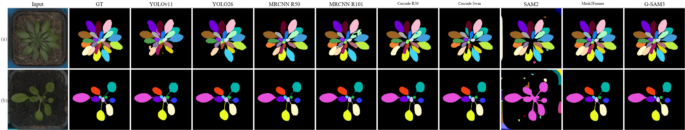
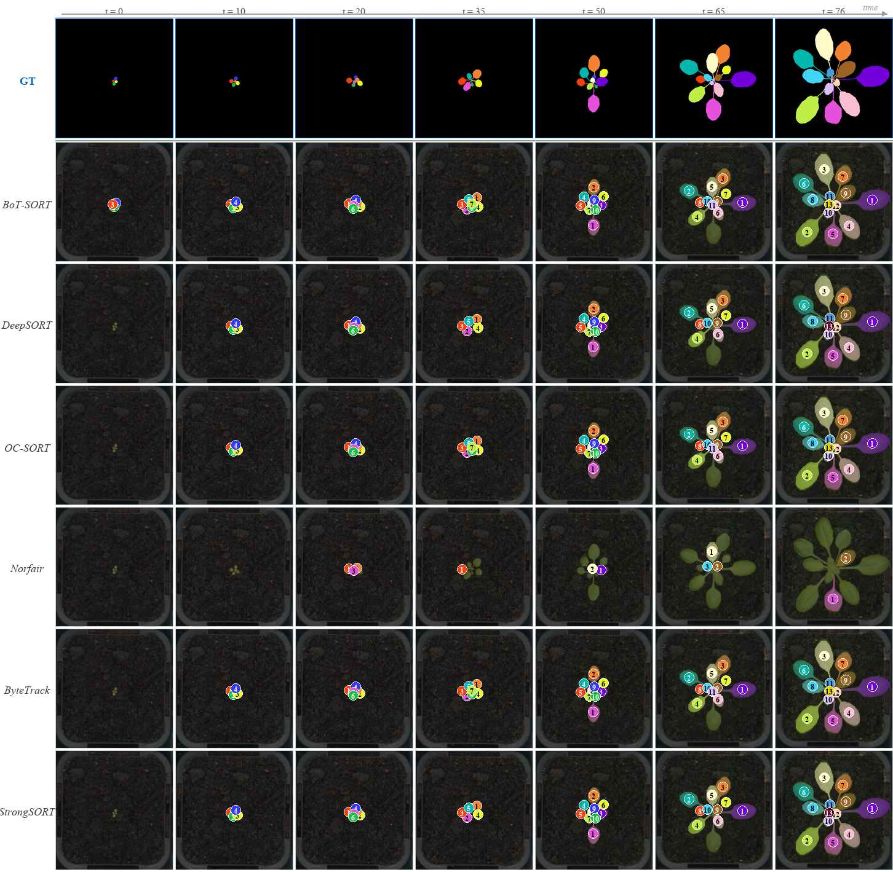

<div align="center">

# PhenoLeaf-TS

**A Time-Series Benchmark for Leaf Instance Segmentation, Tracking, and Growth Stage Classification**

Rijad Sarić · Basim Azam · Sarmad Khan · Edhem Čustović — **ECCV 2026**

[Paper](#) · [Dataset (🤗 Hugging Face)](https://huggingface.co/datasets/basimazam/PhenoLeaf-TS) · [Project page](https://pisyntor.github.io/PhenoLeaf-TS/)


</div>

PhenoLeaf-TS is a time-series dataset of **17,082** top-down RGB images across **21** *Arabidopsis
thaliana* genotypes (**318** plant replicates), annotated with temporally consistent, colour-coded leaf
instance masks (31-colour palette). It defines three tasks — **instance segmentation**, **leaf
tracking**, and **growth-stage classification** — and ships a small, modular toolkit to load the data,
load the baseline models, and evaluate.

| Task | Best baseline | Score |
|------|---------------|-------|
| Instance segmentation | Mask R-CNN R50-FPN (IS-3) | **73.2 mAP** |
| Leaf tracking | ByteTrack (TR-5) | **84.1 % MOTA / 91.0 IDF1** |
| Growth-stage classification | Swin-T (CL-6) | **91.7 % accuracy** |

## Install

```bash
pip install -e .          # core toolkit
pip install -e .[hf]      # + Hugging Face `datasets`
```

## 1 · Data

The dataset is hosted on the Hugging Face Hub:

```python
from phenoleaf_ts.data import load_phenoleaf
ds = load_phenoleaf(split="test", streaming=True)     # train | val | test
ex = next(iter(ds))
ex["image"], ex["mask"], ex["growth_stage"]           # 0=Early, 1=Intermediate, 2=Mature
```

To work from raw files instead, download from the Hub (or Figshare) and convert to model-ready form
(single standard 70/15/15 split + COCO/YOLO annotations + growth-stage labels):

```bash
python tools/prepare_data.py --data_root data/leaf_dataset_colour --output_dir data/prepared --format all
```

Format, palette, and split details: [docs/DATASET.md](docs/DATASET.md).

## 2 · Models

All 21 baselines are declared in [`configs/models.yaml`](configs/models.yaml) and exposed through a
registry:

```python
from phenoleaf_ts.models import list_models, load_model
list_models("classification")                                  # registry entries
clf = load_model("CL-6", checkpoint="checkpoints/CL-6_swin_t.pth")   # Swin-T via timm
seg = load_model("IS-1", checkpoint="checkpoints/IS-1_yolov11.pt")   # YOLOv11 via Ultralytics
```

| Task | Models | Framework |
|------|--------|-----------|
| Segmentation | YOLOv11/26-seg · Mask R-CNN (R50/R101/X101) · Cascade R50 · Mask2Former (Swin-L) · SAM2 · Grounded SAM2 | Ultralytics · Detectron2 · SAM2 |
| Tracking | BoTSORT · DeepSORT · Deep-OC-SORT · Norfair · ByteTrack · StrongSORT | BoxMOT (on YOLOv11 detections) |
| Classification | ResNet-50/101 · EfficientNetV2-S · ViT-B/16 · DINOv2-B · Swin-T | timm |

Trained checkpoints are released alongside the dataset (_link pending_).

## 3 · Evaluate

```python
from phenoleaf_ts.metrics import compute_segmentation_metrics, compute_classification_metrics

seg = compute_segmentation_metrics("pred_mask.png", "gt_mask.png")   # dice, leaf_iou, sbd, ...
cls = compute_classification_metrics(y_true, y_pred, num_classes=3)  # accuracy, f1_macro, mcc, ...
```

Or over a folder / predictions file:

```bash
python tools/evaluate.py --task segmentation  --pred_dir preds/ --gt_dir gts/
python tools/evaluate.py --task classification --pred predictions.json
```

Tracking uses standard MOT metrics (MOTA/IDF1/HOTA) via
[py-motmetrics](https://github.com/cheind/py-motmetrics) / [TrackEval](https://github.com/JonathonLuiten/TrackEval)
over the colour-consistent ground truth.

## Qualitative results

<table>
<tr>
<td align="center"><b>Instance segmentation</b><br></td>
</tr>
<tr>
<td align="center"><b>Leaf tracking</b> (GT + 6 trackers across a sequence)<br></td>
</tr>
</table>

## Repository layout

```
phenoleaf_ts/            # the package
├── data/                #   load_phenoleaf (HF) + prepare.py (raw → COCO/YOLO + split)
├── metrics/             #   segmentation.py · classification.py
└── models/              #   registry + load_model()
configs/models.yaml      # the 21 baselines
tools/                   # prepare_data.py · evaluate.py (CLIs)
assets/                  # figures
docs/                    # DATASET.md · CITATION.cff · index.html
huggingface/             # HF dataset card
```

## Citation

```bibtex
@InProceedings{saric2026phenoleafts,
  author    = {Sari\'c, Rijad and Azam, Basim and Khan, Sarmad and \v{C}ustovi\'c, Edhem},
  title     = {{PhenoLeaf-TS}: A Time-Series Benchmark for Leaf Instance Segmentation, Tracking, and Growth Stage Classification},
  booktitle = {Computer Vision -- ECCV 2026},
  year      = {2026},
  publisher = {Springer Nature Switzerland},
}
```

## License

Code: [Apache-2.0](LICENSE). Dataset: CC BY-NC 4.0 (_to be confirmed_).
