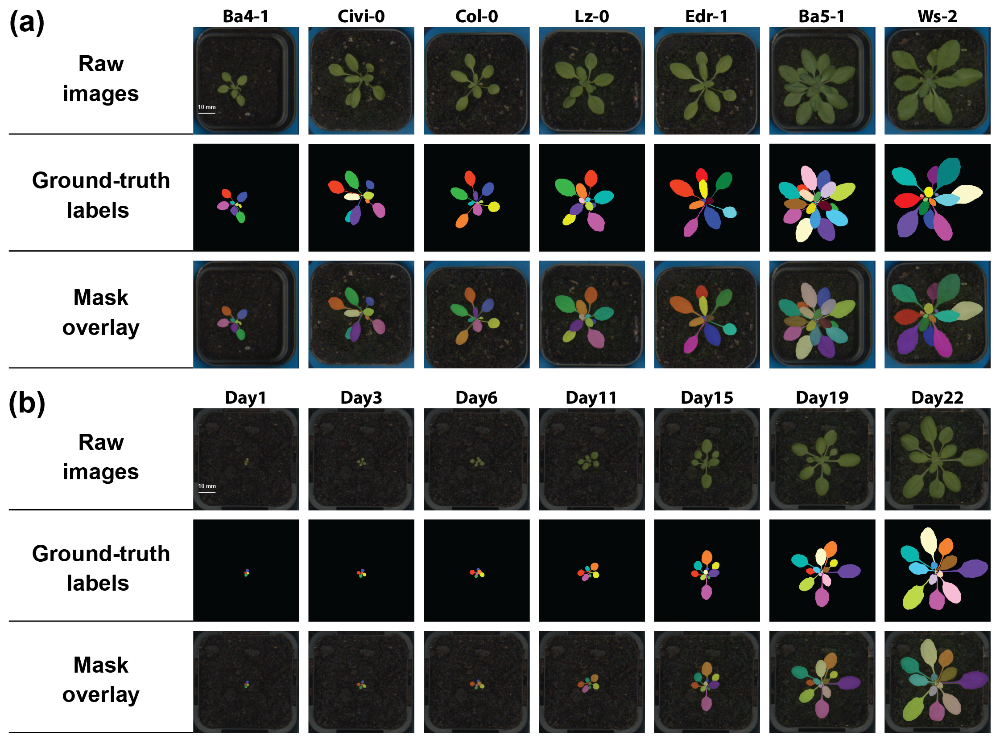
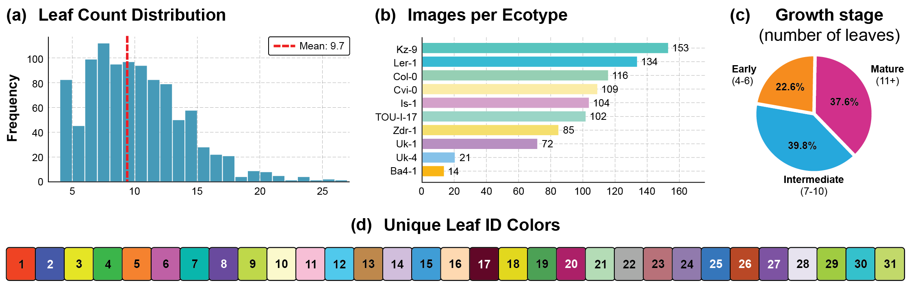

<h1 align="center">PhenoLeaf-TS</h1>

<p align="center">
  A time-series benchmark for leaf instance segmentation, tracking, and growth-stage classification of <i>Arabidopsis thaliana</i>.
</p>

<p align="center">
  <a href="#"></a>
  <a href="https://huggingface.co/datasets/rick77a/PhenoLeaf_TS"></a>
  <a href="https://huggingface.co/basimazam/PhenoLeaf-TS-models"></a>
  <a href="https://pisyntor.github.io/PhenoLeaf-TS/"></a>
  <a href="https://eccv.ecva.net/"></a>
  <a href="https://creativecommons.org/licenses/by/4.0/"></a>
</p>

<p align="center">
  
</p>

We built PhenoLeaf-TS because we kept running into the same gap: there was no dataset that follows the
*same* leaves through time with consistent identities, at a scale large enough to benchmark modern vision
models. So we collected one — **17,082** top-down RGB images of **21** *Arabidopsis* genotypes
(**318** plant replicates), and hand-annotated every leaf with a colour from a fixed 31-colour palette
that stays attached to that leaf for its entire life in the sequence. That single design choice lets you
evaluate segmentation, tracking, and growth stage in one place, and tracking can be scored directly
against the colours with no Hungarian matching step.

The dataset accompanies our ECCV 2026 paper. This repo is the toolkit that goes with it — grab the data,
load a model, and evaluate.

## What's in the benchmark

| Task | Models | Best baseline |
|------|--------|---------------|
| Leaf instance segmentation | 9 (YOLOv11/26, Mask R-CNN R50/R101/X101, Cascade R50, Mask2Former, SAM2, Grounded SAM2) | Mask R-CNN R50 — **73.2 mAP** |
| Leaf tracking | 6 (BoTSORT, DeepSORT, Deep-OC-SORT, Norfair, ByteTrack, StrongSORT) | ByteTrack — **84.1 % MOTA** |
| Growth-stage classification | 6 (ResNet-50/101, EfficientNetV2-S, ViT-B/16, DINOv2-B, Swin-T) | Swin-T — **91.7 % acc** |

Pre-training on PhenoLeaf-TS also transfers: fine-tuning its weights gives up to **+51 mAP** over
zero-shot on Komatsuna.

<p align="center">
  
  <br><sub>Leaf-count distribution, images per genotype, growth-stage split, and the 31-colour palette.</sub>
</p>

## Getting started

```bash
pip install -e .          # toolkit
pip install -e .[hf]      # + Hugging Face hub client (for the download helper)
```

**Get the data.** It lives on the Hugging Face Hub as a single archive (~5.5 GB):

```python
from phenoleaf_ts.data import download_phenoleaf
download_phenoleaf("data")    # downloads + unzips PhenoLeaf-TS_DS.zip
```

Then turn it into model-ready splits (one standard 70/15/15 split + COCO/YOLO labels + growth-stage labels):

```bash
python tools/prepare_data.py --data_root data/leaf_dataset_colour --output_dir data/prepared
```

Format, palette, and split details live in [docs/DATASET.md](docs/DATASET.md).

## Loading models and evaluating

All 21 baselines sit in a small registry ([`configs/models.yaml`](configs/models.yaml)):

```python
from phenoleaf_ts.models import list_models, load_model

list_models("segmentation")          # browse the registry
seg = load_model("IS-3")             # Mask R-CNN R50 — weights auto-downloaded from the HF Hub
clf = load_model("CL-6")             # Swin-T
```

Released checkpoints — **IS-3** (Mask R-CNN R50), **CL-6** (Swin-T), and the **IS-1** YOLOv11 detector used
for tracking — are on the Hub at
[🤗 basimazam/PhenoLeaf-TS-models](https://huggingface.co/basimazam/PhenoLeaf-TS-models) and load
automatically when you omit `checkpoint`.

Metrics are in [`phenoleaf_ts/metrics`](phenoleaf_ts/metrics):

```python
from phenoleaf_ts.metrics import compute_segmentation_metrics, compute_classification_metrics

compute_segmentation_metrics("pred_mask.png", "gt_mask.png")     # dice, leaf_iou, sbd, ...
compute_classification_metrics(y_true, y_pred, num_classes=3)    # accuracy, f1_macro, mcc, ...
```

…or from the command line:

```bash
python tools/evaluate.py --task segmentation  --pred_dir preds/ --gt_dir gts/
python tools/evaluate.py --task classification --pred predictions.json
```

Tracking uses standard MOT metrics (MOTA / IDF1 / HOTA) via
[py-motmetrics](https://github.com/cheind/py-motmetrics) / [TrackEval](https://github.com/JonathonLuiten/TrackEval).

## Layout

```
phenoleaf_ts/   data/ (download + prepare) · metrics/ · models/ (registry + load_model)
configs/        models.yaml — the 21 baselines
tools/          prepare_data.py · evaluate.py
docs/           DATASET.md · CITATION.cff
```

## Citation

```bibtex
@InProceedings{saric2026phenoleafts,
  author    = {Sari\'c, Rijad and Azam, Basim and Khan, Sarmad and \v{C}ustovi\'c, Edhem},
  title     = {{PhenoLeaf-TS}: A Time-Series Benchmark for Leaf Instance Segmentation, Tracking, and Growth Stage Classification},
  booktitle = {Computer Vision -- ECCV 2026},
  year      = {2026},
  publisher = {Springer Nature Switzerland},
}
```

## License

Code is Apache-2.0. The dataset is released under CC BY 4.0.
